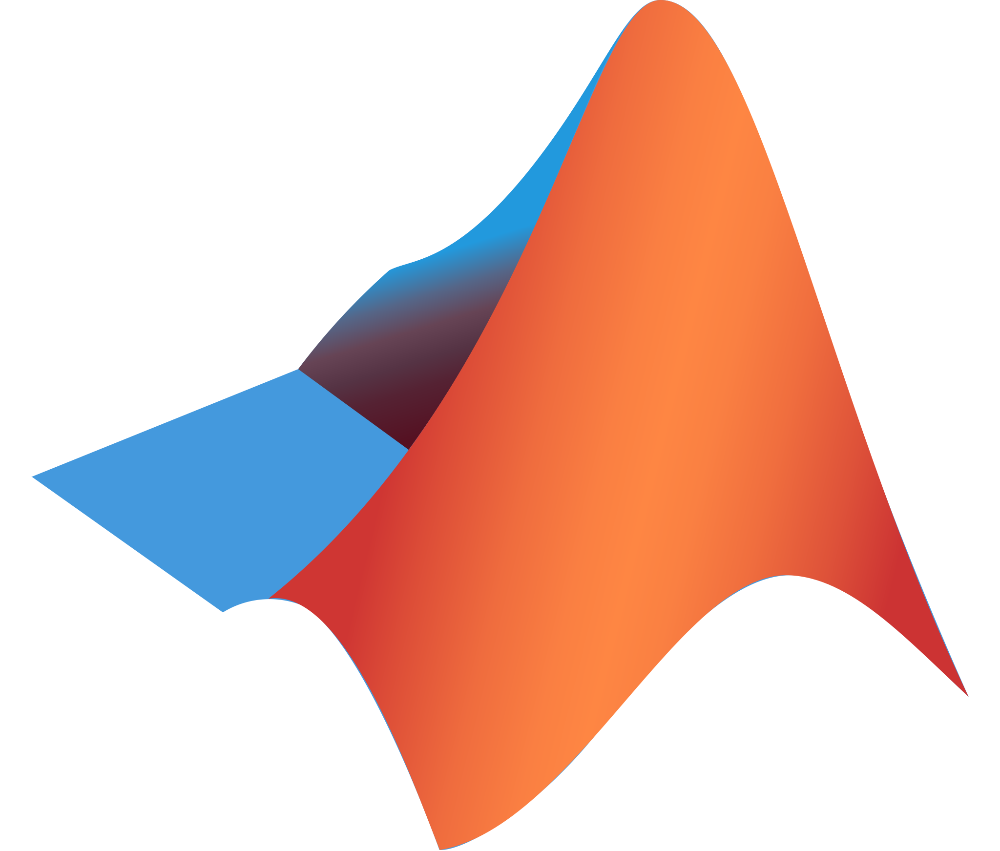

## 👋 Hi

- 🔭 We (Barana/Bɑːrɑːnɑː/ Software) provide software product development and consultancy services.
- 🌱 We have 20+ years of experience in application and solution developments for Healthcare, Retail, Higher-Ed and
  Telecom... industries.
- ⚙️ Our expertise includes delivering user facing applications to implementing data-intensive AI/ML data pipelines to
  lower level system software(compilers, linkers etc..) implementation.
- 📫 You can contact us by emailing contact@baranasoftware.com. We are happy to discuss how we can collaborate with you
  to
  turn your idea into a product or help with your project.

## 🔨🔧 Tech Stack

    
    
    
    
    
    
    
    
    

    
    

  
  
  
  
  
  
  
  

  
  
  
  

  
  

  
  
  
  
  

  
  
  

## 💻 Projects Portfolio

| Project                                                                                                                             | Tech Stack                                                                                                                                                                                                                                                                                                                                                          |
|-------------------------------------------------------------------------------------------------------------------------------------|---------------------------------------------------------------------------------------------------------------------------------------------------------------------------------------------------------------------------------------------------------------------------------------------------------------------------------------------------------------------|
| [Design and Implementation of a REST API for Curricular data in Higher Education](https://github.com/baranasoftware/curricular-api) |       |
| [Lexer and parser for parsing query parameters written in Go](https://github.com/baranasoftware/query-parser)                       |                                                                                                                                                                                                                                                                           |
| [High performance EDI parser and library written in Zig](https://github.com/baranasoftware/edi)                                     |                                                                                                                                                                                                                                                                        |
| [UX design portfolio](https://github.com/baranasoftware/ux-design)                                                                  |                                                                                                                                                                         |
| [UX design and implementation for a Directory Service app](https://github.com/baranasoftware/directory-service)                     |   
| [UX design and implementation for a Background Search app](https://github.com/baranasoftware/background-app)                        |                                                                                                                                                                              |
| [Example tool-chain written in Rust](https://github.com/baranasoftware/tool-chain)                                                          |                                                                                                                                                                                                                                                                   |
| [Writing a compiler using LLVM: Building a BigNum Calculator](https://github.com/baranasoftware/bignum)                             |                                                                                                                                                                                                                                                                                                                  |
| [Development of an AI Agent](https://github.com/baranasoftware/ai-agent)                                                            |                                                                                                                                                                                                                                                                        |
| [Collections of Zig examples](https://github.com/baranasoftware/zig-examples)                                                       |                                                                                                                                                                                                                                                                        |
| [Collection of system programming examples in C](https://github.com/baranasoftware/system)                                          |                                                                                                                                                                                                                                                                 |

